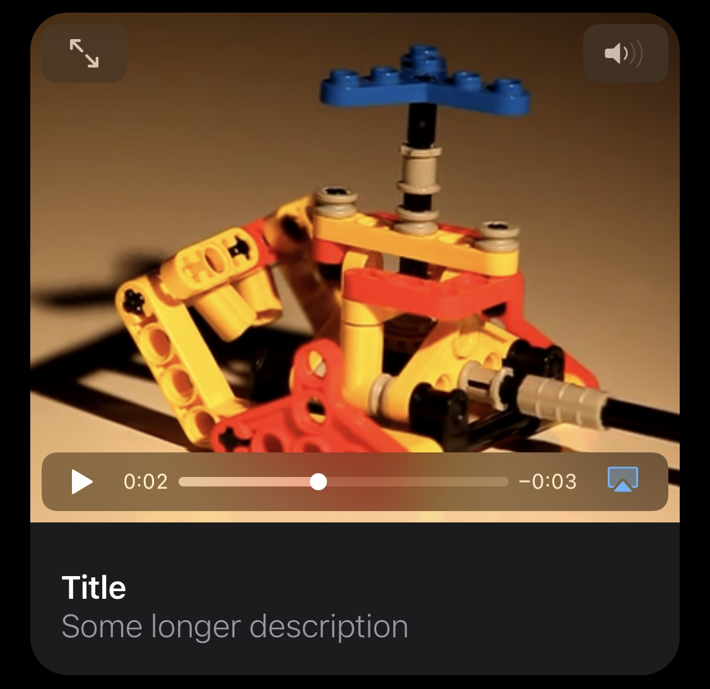
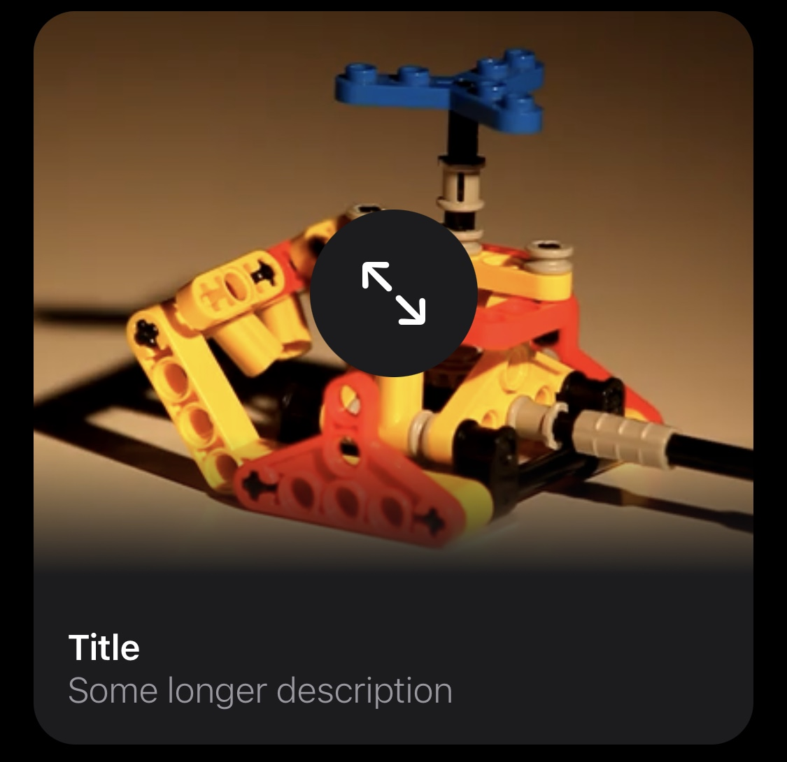

# VideoPlayer
µFramework containing a SwiftUI Video Player allowing for custom controls.

**Warning** it's still buggy as hell 😭

## Installation
### Swift Package Manager

You can install VideoPlayer via [Swift Package Manager](https://swift.org/package-manager/) by adding the following line to your `Package.swift`:

```swift
import PackageDescription

let package = Package(
    [...]
    dependencies: [
        .package(url: "https://github.com/nerdsupremacist/VideoPlayer.git", from: "0.2.0")
    ]
)
```

## Usage

You can just drop it in a view like so:

```swift
let player = AVPlayer(...)

VStack(alignment: .leading) {
    VideoPlayer(player: player)

    VStack(alignment: .leading) {
        Text("Title").font(.headline).fontWeight(.semibold).foregroundColor(.primary)
        Text("Some longer description").font(.body).fontWeight(.light).foregroundColor(.secondary)
    }
    .padding(.all, 16)
}
.background(Color.systemGray6)
.clipShape(RoundedRectangle(cornerRadius: 20))
.height(350)
.padding(.horizontal, 16)
```



Or you can provide custom controls like in this example where we only allow a full screen button in the middle:

```swift
VStack(alignment: .leading) {
    VideoPlayer(player: player) { player in
        // Player argument allows us to toggle full screen status
        Button(action: { player.isFullScreen.toggle() }) {
            Image(
                systemName: player.isFullScreen ? "arrow.down.right.and.arrow.up.left" : "arrow.up.left.and.arrow.down.right"
            )
            .resizable()
            .aspectRatio(contentMode: .fit)
            .foregroundColor(.primary)
            .frame(width: 30, height: 30)
        }
        .frame(width: 80, height: 80)
        .background(Color.systemGray6)
        .clipShape(Circle())
    }

    VStack(alignment: .leading) {
        Text("Title").font(.headline).fontWeight(.semibold).foregroundColor(.primary)
        Text("Some longer description").font(.body).fontWeight(.light).foregroundColor(.secondary)
    }
    .padding(.all, 16)
}
.background(Color.systemGray6)
.clipShape(RoundedRectangle(cornerRadius: 20))
.height(350)
.padding(.horizontal, 16)
```


